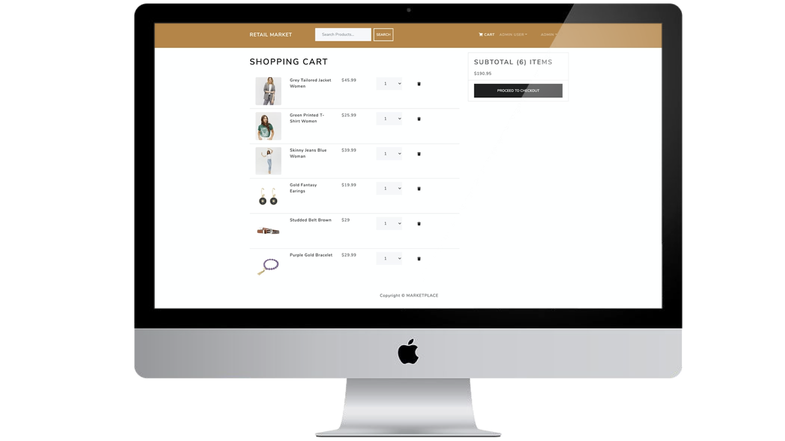

# Usage

## Retail Marketplace (MongoDB, NodeJS, ExpressJS, ReactJS & JWT)

### Clone Repositorie

Clone this Repositorie to your local machine

```
git clone https://github.com/eugenebelieve/marketplace-retail.git
```

### Add Env Variables

Create or modify the .env file in then root and add the following

```
NODE_ENV = 'development'
PORT = '5000'
MONGO_URI = "YOUR_MONGODB_URI_HERE"
JWT_SECRET = 'random_secret_key'
PAYPAL_CLIENT_ID = 'YOUR_MONGODB_PAYPAL_ID_HERE'
```

### Install Dependencies (frontend & backend)

```
npm install
cd application
npm install
```

### Import Dataset

You can use the following commands generate some sample users and products as well as destroy all data, directly in your Database

```
# To Import Retail & User Data, run command from root directory
npm run data:retail

# Destroy data
npm run data:destroy
```

### Run

```
# Run frontend Application (:3000) & Microservices (:5000), from root directory 
npm run dev
```

### Generated Accounts

```
#Sample User Logins created

admin@example.com (Admin)
123456

john@example.com (Customer)
123456

jane@example.com (Customer)
123456
```

## More Previews (Product & Shopping Cart)

<div>


</div>